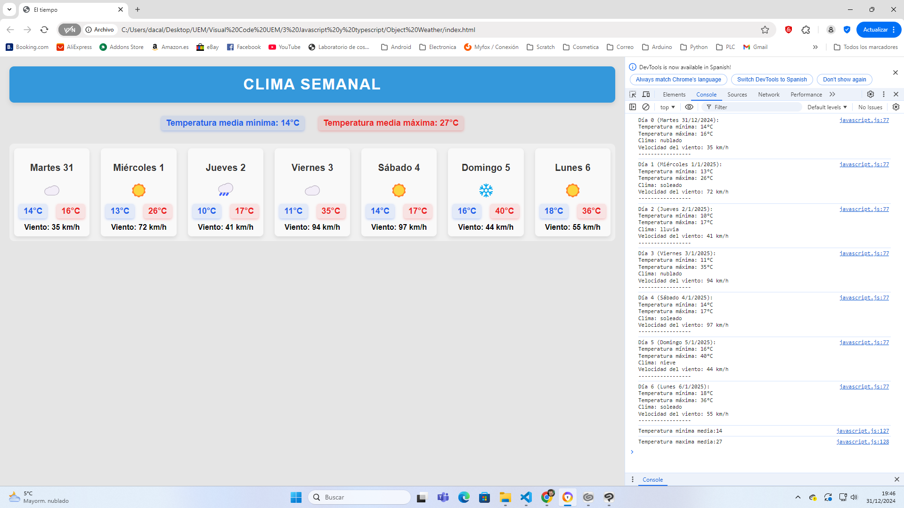

2. **Abre los archivos en tu navegador**:
   - Navega a la carpeta del proyecto y abre el archivo `index.html` en tu navegador favorito para ver la página web en funcionamiento.

3. **Modifica el código**:
   - Si deseas personalizar el comportamiento del clima o el diseño, puedes editar los archivos:
     - `index.html` para la estructura de la página.
     - `styles.css` para los estilos visuales.
     - `javascript.js` para modificar la lógica que genera el clima aleatorio.

## Capturas de Pantalla

Aquí puedes agregar algunas capturas de pantalla para mostrar cómo se ve tu proyecto:

## Contribuciones

Las contribuciones son bienvenidas. Si deseas mejorar el proyecto, abre un **pull request** con tus cambios. Para problemas o sugerencias, por favor abre un **issue** en el repositorio.

## Licencia

Este proyecto está bajo la licencia [MIT](LICENSE).
